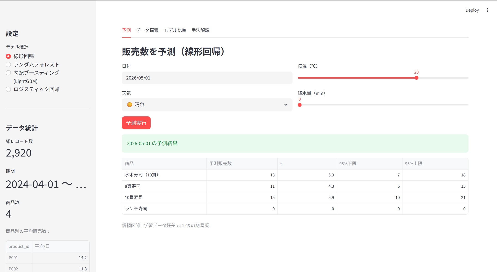
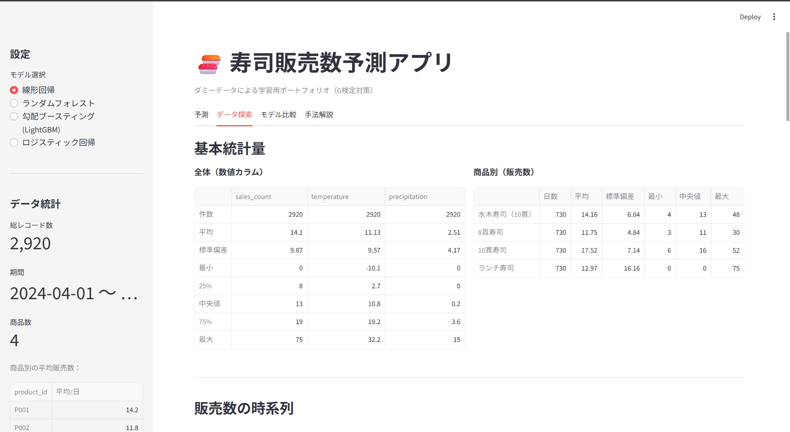
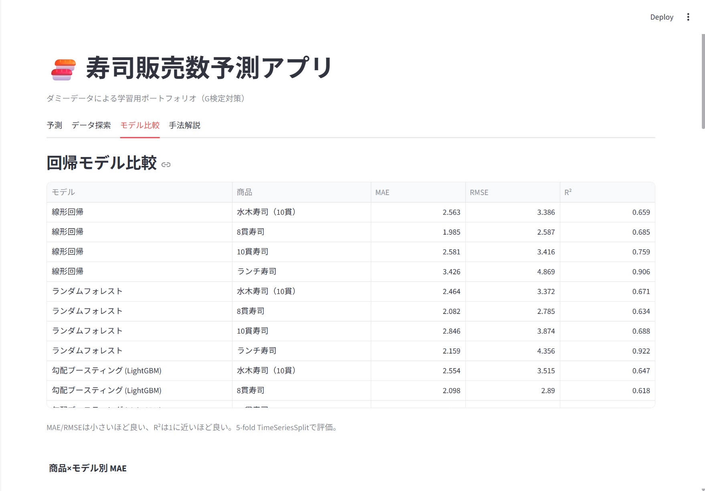

# 🍣 sushi-predictor

寿司商品の販売数を、日付・曜日・天気などから予測する Streamlit アプリ。
G検定取得に向けた学習およびポートフォリオを目的とした個人プロジェクトです。

> **Note**：本プロジェクトで使用するデータはすべて**ダミーデータ**です。実在する店舗の売上データは一切使用していません。

---

## このプロジェクトについて（位置付け）

このプロジェクトは「**コーディング経験ゼロのユーザーが、Claude Code（AIコーディングエージェント）を使ってどこまでフルスタックWebアプリを完成させられるか**」の実験記録です。仕様書作成、要件定義、実装方針の判断、モデル選定の意思決定はすべて人間が行い、コード生成・実装・ドキュメント執筆はすべて Claude Code が担当しました。

各マイルストーン（M1〜M5）の進捗は Git のコミット履歴とタグで追跡可能です。Co-Authored-By のフィールドにも `Claude Opus 4.7` が記録されています。

---

## 1. プロジェクト概要

過去 2 年分のダミー販売データと気象条件を入力として、4 種類の機械学習モデル（線形回帰・ロジスティック回帰・ランダムフォレスト・勾配ブースティング）で寿司商品別の販売数を予測する Web アプリです。

主な機能：
- **予測**：日付・天気・気温・降水量を入力し、4商品の販売数を予測（信頼区間付き）
- **データ探索**：時系列・曜日別・天気別・相関ヒートマップで生データを可視化
- **モデル比較**：4モデルの精度を MAE / RMSE / R² や混同行列で比較、特徴量重要度・残差プロットも表示
- **手法解説**：各モデルの数学的背景・採用判断・「なぜLLMが不要か」を解説（[`docs/methodology.md`](./docs/methodology.md)）

## 2. デモ

### 予測タブ



### データ探索タブ



### モデル比較タブ



> スクリーンショット画像は `docs/images/` 配下に配置。Streamlit Cloud 公開後はライブデモ URL もここに追加します。

## 3. 技術スタック

| 項目 | 採用技術 |
|---|---|
| 言語 | Python 3.11+ |
| Web フレームワーク | Streamlit |
| 機械学習 | scikit-learn 1.8、LightGBM 4.6 |
| データ操作 | pandas 3.0、numpy 2.4 |
| 可視化 | plotly、matplotlib、seaborn |
| バージョン管理 | Git / GitHub |
| 開発支援 | Claude Code（Anthropic Opus 4.7） |

## 4. なぜこのアプローチか

- **古典統計手法を選んだ理由**：データ規模（約 2,920 行）と予測タスクの性質を考えると、線形回帰や決定木系で十分な精度が出ます。解釈性が高く、特徴量の効き方を説明できる点も学習目的に合致します。
- **LLM を予測モデルとして採用しない理由**：販売数予測は構造化された数値データに対する回帰問題であり、自然言語処理モデルの出番はありません。LLM を使うとコスト・レイテンシ・解釈性のすべてが悪化します。**ただし、開発支援としての LLM（Claude Code）は別軸**で、本プロジェクト自体がその有効性を実証しています。
- **詳細**：[`docs/methodology.md`](./docs/methodology.md) で各モデルの選定根拠・評価指標・「LLM不要論の射程」を解説。

## 5. データ仕様

ダミーデータの仕様は [`spec.md`](./spec.md) のセクション 4 を参照してください。

- **期間**：2024-04-01 〜 2026-03-31（730 日）
- **商品数**：4 種類（P001〜P004）
- **総レコード数**：2,920 行
- **生成元**：[`data/generate_data.py`](./data/generate_data.py)（乱数シード固定＝42、再現可能）

カラム：`date, product_id, product_name, day_of_week, is_weekend, is_holiday, is_pension_day, is_sale_day, weather, temperature, precipitation, sales_count`

## 6. インストール・実行方法

### 必要環境
- Python 3.11 以上
- Windows / macOS / Linux

### セットアップ

```bash
# 1. リポジトリを clone
git clone https://github.com/snowman1983-04/sushi-predictor.git
cd sushi-predictor

# 2. 仮想環境を作成し依存パッケージをインストール
python -m venv .venv
# Windows:
.venv\Scripts\activate
# macOS/Linux:
source .venv/bin/activate
pip install -r requirements.txt

# 3. （任意）ダミーデータを再生成。リポジトリには既に生成済CSVが含まれます。
python data/generate_data.py

# 4. （任意）モデルを事前学習。アプリ初回起動時に自動学習されますが、CLI からも可能。
python -m src.trainer

# 5. Streamlit アプリを起動
streamlit run app.py
```

ブラウザで `http://localhost:8501` を開くとアプリが表示されます。

## 7. モデル比較結果

5-fold TimeSeriesSplit による交差検証の結果（販売数の単位は「個」）：

### 回帰モデル（MAE：小さいほど良い）

| 商品 | 線形回帰 | ランダムフォレスト | LightGBM |
|---|---:|---:|---:|
| P001 水木寿司（10貫） | 2.56 | **2.46** | 2.55 |
| P002 8貫寿司         | **1.99** | 2.08 | 2.10 |
| P003 10貫寿司        | **2.58** | 2.85 | 3.01 |
| P004 ランチ寿司       | 3.43 | **2.16** | 2.65 |

### 分類モデル（ロジスティック回帰、3クラス：少/普/多）

| 商品 | 正解率 | F1 (macro) |
|---|---:|---:|
| P001 | 0.683 | 0.644 |
| P002 | 0.706 | 0.687 |
| P003 | 0.696 | 0.641 |
| P004 | 0.916 | 0.819 |

詳細な分析と考察は [`docs/model_comparison.md`](./docs/model_comparison.md) を参照。

## 8. ディレクトリ構成

```
sushi-predictor/
├── README.md
├── spec.md                    # プロジェクト仕様書
├── requirements.txt
├── .gitignore
├── .streamlit/
│   └── config.toml            # Streamlit テーマ設定（白背景固定）
├── app.py                     # Streamlit エントリーポイント
├── data/
│   ├── generate_data.py       # ダミーデータ生成スクリプト
│   └── sushi_sales.csv        # 生成データ（git 管理対象）
├── src/
│   ├── data_loader.py         # CSV 読み込み
│   ├── feature_engineering.py # 特徴量作成 + 祝日判定 + 3クラス離散化
│   ├── models.py              # 4モデルのレジストリ
│   ├── trainer.py             # 学習・評価・保存
│   ├── predictor.py           # 推論
│   └── eda.py                 # 探索的データ分析チャート
├── models/                    # 学習済みモデル保存先（git 管理外、`.gitkeep` のみ追跡）
├── notebooks/                 # （将来用、現状は空）
└── docs/
    ├── methodology.md         # 手法解説（G検対策）
    ├── model_comparison.md    # モデル比較レポート
    └── images/                # スクリーンショット
```

## 9. 学んだこと（G検対策の観点）

このプロジェクトを通じて、以下の概念を実装ベースで身につけました：

- **特徴量エンジニアリング**：日付からの月・曜日抽出、One-Hot Encoding、boolフラグの数値化、StandardScalerによる標準化。同じデータでも特徴量設計次第で線形モデルが非線形モデルに匹敵することを体感。
- **モデルファミリーの違い**：
  - 線形モデル（線形回帰・ロジスティック回帰）の解釈性
  - アンサンブル学習（ランダムフォレスト＝バギング、勾配ブースティング＝ブースティング）の精度と複雑さのトレードオフ
- **時系列交差検証（TimeSeriesSplit）**：通常の KFold が時系列で使えない理由、未来情報のリークを防ぐ設計。
- **回帰と分類の評価指標**：MAE/RMSE/R² と Accuracy/Precision/Recall/F1 の使い分け、混同行列の読み方。
- **3クラス離散化**：連続値の回帰タスクを分類問題に変換する手法、退化ケース（ゼロ膨張分布）への対処。
- **モデルの保存と再利用**：joblib による pkl 永続化、Streamlit での `@st.cache_resource` 活用。
- **再現性**：乱数シード固定、CSV をリポジトリに含める判断、依存パッケージの固定。

詳しい解説と各モデルの数式は [`docs/methodology.md`](./docs/methodology.md) を参照。

## 10. ライセンス

MIT License — [`LICENSE`](./LICENSE) を参照。

## 11. 開発体制

- **企画・要件定義・意思決定**：プロジェクト管理者（人間）
- **コード生成・実装・ドキュメント執筆**：Claude Code（Anthropic Opus 4.7）
- 開発期間：2026-04-27 〜 2026-04-28（M1〜M5、約2日）
- マイルストーンごとのタグ：`v0.1.0-m1` 〜 `v1.0.0-m5`

このプロジェクトは「AIコーディングエージェントは、非エンジニアの企画意図を、動作するアプリケーションへ翻訳できるか？」というテーマの実証実験でもあります。詳細は [`docs/methodology.md`](./docs/methodology.md) のセクション「AIの適材適所」を参照してください。

---

**ステータス**：✅ M5 完了（公開準備中）
**仕様書**：[`spec.md`](./spec.md)
